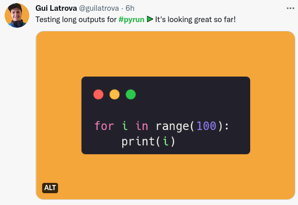

# How it works

## 1. Finding relevant content

Finds a tweet or post with the [#pyrun](https://twitter.com/hashtag/pyrun) tag and mark it so your audience can execute the code inside.

It allows you audience to filter your content using this hashtag.

## 2. Extract its code

- Looks for **any** image inside (preferably generated with [Carbon](https://carbon.now.sh/) or [Snappify](https://snappify.io/)).
- Extracts the code from the ALT.

## 3. Execute the code

It executes the Python code using [Pyodide](https://pyodide.org/) in an isolated sandbox which means it's safe to run in your browser:

## 4. Shares the snippet

It integrates with [Snappify](https://snappify.io/) to allow you to copy/paste it inside the platform.
