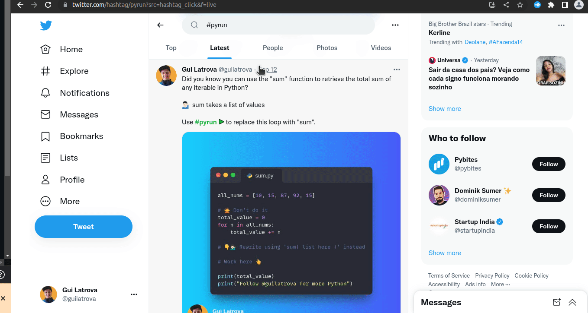
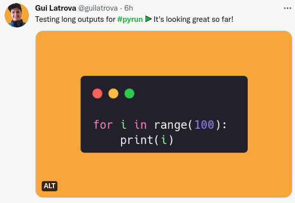
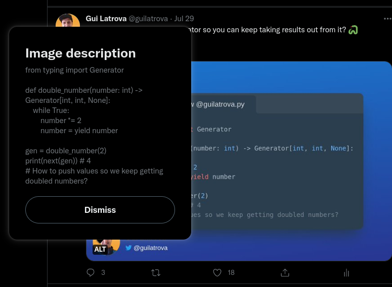
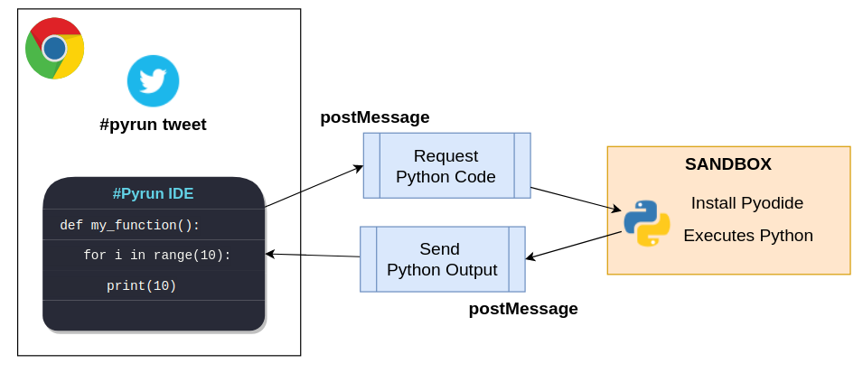

# Welcome to Pyrun

Pyrun is an extension that integrates an IDE inside your Twitter, Linkedin, and Facebook.

## Get started

You can install the extension from the [Chrome Webstore](https://chrome.google.com/webstore/detail/pyrun/mpkfgkeapfgoamnbdopmdlgilhjhiini?hl=en&authuser=0).

## How it works

Finds a tweet or post with the [#pyrun](https://twitter.com/hashtag/pyrun) tag and mark it so your audience can execute the code inside.

### Extract its code

- Looks for an image inside (Preferably generated with [Carbon](https://carbon.now.sh/) or [Snappify](https://snappify.io/)).
- Extracts the code from the ALT.

### Execute the code

It executes the Python code using [Pyodide](https://pyodide.org/) in an isolated sandbox, which means it's safe to run in your browser:

