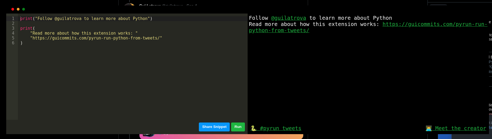

# Links

Pyrun's console is clickable.

That means your audience can click on any URL and any handle (starting with `@`).

Take as example:

```py
print("Follow @guilatrova to learn more about Python")

print(
    "Read more about how this extension works: "
    "https://guicommits.com/pyrun-run-python-from-tweets/"
)
```


